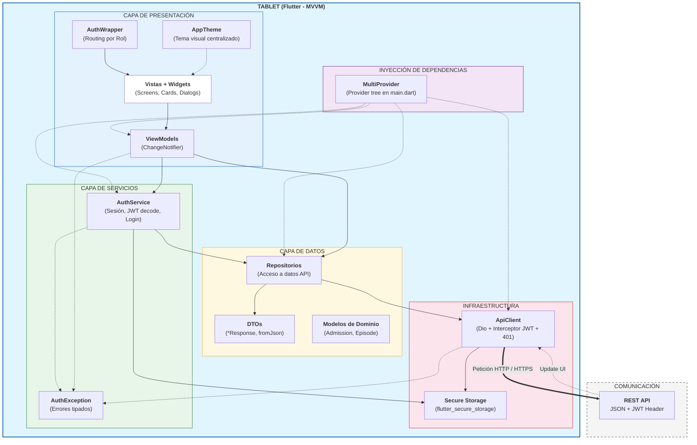

<a id="readme-top"></a>

<div align="center">
  
  <h1>Klinico — App de Gestión Clínica Hospitalaria</h1>
  <p>Plataforma móvil para la digitalización del flujo de trabajo médico en los pases de planta hospitalarios.</p>

  
  
  
  
</div>

---

## Tabla de contenidos

- [Descripción](#descripción)
- [Funcionalidades](#funcionalidades)
- [Interfaz de usuario (Diseño)](#interfaz-de-usuario)
- [Arquitectura](#arquitectura)
- [Estructura del proyecto](#estructura-del-proyecto)
- [Stack tecnológico](#stack-tecnológico)
- [Primeros pasos](#primeros-pasos)
  - [Prerrequisitos](#prerrequisitos)
  - [Configuración del backend](#configuración-del-backend)
  - [Instalación y ejecución](#instalación-y-ejecución)
- [Roles de usuario](#roles-de-usuario)
- [Repositorio del backend](#repositorio-del-backend)
- [Contacto](#contacto)
- [License](#license)

---

## Descripción

**Klinico** es una aplicación móvil multiplataforma (Android / iOS) construida con Flutter que digitaliza el flujo de trabajo durante el pase de planta hospitalario. Cubre desde el ingreso del paciente hasta su alta, pasando por la gestión de episodios clínicos, la asignación de nuevos ingresos en cada servicio y la monitorización de KPIs de rendimiento por parte del jefe de servicio.

El sistema distingue dos perfiles de usuario con vistas y permisos diferenciados: **médico** y **jefe de servicio**.

<p align="right">(<a href="#readme-top">volver arriba</a>)</p>

---

## Funcionalidades

### Médico
- Inicio de sesión seguro con JWT almacenado de forma cifrada.
- Consulta de admisiones activas asignadas a sí mismo.
- Creación y edición de admisiones de pacientes.
- Gestión de episodios clínicos asociados a cada admisión.
- Escalas clínicas integradas: **Barthel**, **Braden**, **CAM** y **CHADS₂**.
- Alta del paciente.
- Búsqueda y consulta de admisiones activas en el servicio.

### Jefe de servicio
- Dashboard de KPIs del servicio con gráficos interactivos.
- Visualización y asignación de nuevas admisiones a médicos del servicio.
- Tabla de carga de trabajo por médico.
- Búsqueda y consulta de admisiones activas en el servicio.
- Creación y edición de admisiones de pacientes.
- Gestión de episodios clínicos asociados a cada admisión.
- Escalas clínicas integradas: **Barthel**, **Braden**, **CAM** y **CHADS₂**.
- Alta del paciente.

### Comunes
- Autenticación con token JWT (expiración y renovación automática).
- Cierre de sesión con limpieza del almacenamiento seguro.
- Redirección automática al login ante sesión caducada (interceptor 401).
- Tema visual personalizado coherente con identidad corporativa.

<p align="right">(<a href="#readme-top">volver arriba</a>)</p>

---

## Interfaz de usuario (Diseño)

> _Añadir capturas de pantalla aquí._

| Login | Médico — Home | Jefe de Servicio — KPIs |
|-------|--------------|------------------------|
|  |  |  |

<p align="right">(<a href="#readme-top">volver arriba</a>)</p>

---

## Arquitectura

Klinico sigue el patrón **MVVM (Model-View-ViewModel)**, recomendado por Google para Flutter, combinado con el patrón **Repository**, lo que permite desacoplar completamente la lógica de negocio de la interfaz de usuario y de la fuente de datos.



- **Views**: widgets de pantalla, sin lógica de negocio.
- **ViewModels**: gestionan el estado de cada pantalla con `ChangeNotifier` y son expuestos mediante `Provider`.
- **Repositories**: única fuente de verdad para cada entidad de dominio; realizan las llamadas HTTP a través de `ApiClient`.
- **ApiClient**: cliente `Dio` centralizado con interceptores para inyección del token Bearer y gestión global del error 401 (redirige al login sin necesidad de `BuildContext`).
- **AuthService**: gestiona el ciclo de vida de la sesión (login, logout, decodificación del JWT y comprobación de expiración).

<p align="right">(<a href="#readme-top">volver arriba</a>)</p>

---

## Estructura del proyecto

```text
lib/
├── core/
│   ├── api_client.dart          # Cliente Dio: base URL, interceptores Bearer y 401
│   ├── exceptions/              # Excepciones personalizadas (AuthException, etc.)
│   ├── models/                  # Modelos de dominio compartidos (Admission, Episode)
│   └── theme/                   # Tema Material de la aplicación
├── data/
│   ├── models/                  # DTOs de respuesta de la API (JSON → Dart)
│   ├── repositories/            # Lógica de acceso a datos por entidad
│   └── services/
│       └── auth_service.dart    # Login, logout, gestión y decodificación del JWT
├── ui/
│   ├── views/
│   │   ├── login_view.dart
│   │   ├── home_view.dart       # Enrutamiento por rol tras autenticación
│   │   ├── medico_main_view.dart
│   │   ├── jefeservicio_main_view.dart
│   │   ├── admissions/          # Búsqueda, formulario y detalle de admisiones
│   │   ├── episodes/            # Formulario y detalle de episodios clínicos
│   │   └── servicekpis/         # Dashboard KPIs, nuevas admisiones, carga de trabajo
│   ├── viewmodels/              # Estado y lógica de cada pantalla (ChangeNotifier)
│   └── widgets/                 # Componentes reutilizables (tarjetas, escalas, gráficos)
└── main.dart                    # Punto de entrada: MultiProvider, AuthWrapper, tema
```

<p align="right">(<a href="#readme-top">volver arriba</a>)</p>

---

## Stack tecnológico

| Categoría | Tecnología |
|-----------|-----------|
| Framework UI | [Flutter](https://flutter.dev) |
| Lenguaje | [Dart](https://dart.dev) `^3.11.3` |
| HTTP client | [Dio](https://pub.dev/packages/dio) `^5.9.2` |
| Estado | [Provider](https://pub.dev/packages/provider) `^6.1.5` |
| Almacenamiento seguro | [flutter_secure_storage](https://pub.dev/packages/flutter_secure_storage) `^10.0.0` |
| Gráficos | [fl_chart](https://pub.dev/packages/fl_chart) `^1.2.0` |
| Testing | [mocktail](https://pub.dev/packages/mocktail) `^1.0.4` |
| Autenticación | JWT (Bearer Token) |

<p align="right">(<a href="#readme-top">volver arriba</a>)</p>

---

## Primeros pasos

### Prerrequisitos

- **Flutter SDK** 3.x o superior → [Guía de instalación](https://docs.flutter.dev/get-started/install)
- **Dart SDK** `^3.11.3` (incluido con Flutter)
- **Android Studio** o **Xcode** según la plataforma destino
- **JDK 17** (necesario para el backend Spring Boot)
- El backend **klinico-api** corriendo localmente (ver sección siguiente)

Verifica tu entorno con:

```bash
flutter doctor
```

### Configuración del backend

Clona y arranca el servidor antes de lanzar la app:

```bash
git clone https://github.com/SergioLM7/klinico-api
cd klinico-api
# Sigue las instrucciones del README del backend para configurar la base de datos y las variables de entorno
./mvnw spring-boot:run
```

El servidor escucha por defecto en `http://localhost:8080/api/v1`.

> **Emulador Android:** la app apunta automáticamente a `10.0.2.2:8080` cuando detecta la plataforma Android, que es el alias del `localhost` del host en el emulador de Android Studio.

### Instalación y ejecución

```bash
# 1. Clona este repositorio
git clone https://github.com/SergioLM7/klinico-front
cd klinico-front

# 2. Instala las dependencias
flutter pub get

# 3. (Opcional) Regenera los iconos del launcher
dart run flutter_launcher_icons

# 4. Ejecuta la app en un emulador o dispositivo conectado
flutter run

# Para Android en modo release
flutter build apk --release

# Para iOS en modo release
flutter build ios --release
```

<p align="right">(<a href="#readme-top">volver arriba</a>)</p>

---

## Roles de usuario

La app enruta automáticamente a la interfaz correspondiente según el campo `role` del JWT recibido tras el login:

| Rol | Interfaz | Acceso |
|-----|----------|--------|
| `MEDICO` | `MedicoMainView` | Gestión de admisiones y episodios clínicos |
| `JEFESERVICIO` | `JefeServicioMainView` | Dashboard de KPIs y carga de trabajo del servicio |

Cualquier otro rol reconocido o no por el backend recibe un diálogo de acceso no autorizado, antes de ser redirigido a la vista de login.

<p align="right">(<a href="#readme-top">volver arriba</a>)</p>

---

## Repositorio del backend

La API REST con la que se comunica esta aplicación está desarrollada en **Spring Boot** y disponible en:

**[https://github.com/SergioLM7/klinico-api](https://github.com/SergioLM7/klinico-api)**

<p align="right">(<a href="#readme-top">volver arriba</a>)</p>

## 👨🏽‍💻 Contacto

**Sergio Lillo, Full Stack Software Developer**
<a href="https://www.linkedin.com/in/lillosergio/" target="_blank"></a> - sergiolillom@gmail.com

## © MIT License

Copyright (©) 2026, Sergio Lillo

Permission is hereby granted, free of charge, to any person obtaining a copy
of this software and associated documentation files (the "Software"), to deal
in the Software without restriction, including without limitation the rights
to use, copy, modify, merge, publish, distribute, sublicense, and/or sell
copies of the Software, and to permit persons to whom the Software is
furnished to do so, subject to the following conditions:

The above copyright notice and this permission notice shall be included in all
copies or substantial portions of the Software.

THE SOFTWARE IS PROVIDED "AS IS", WITHOUT WARRANTY OF ANY KIND, EXPRESS OR
IMPLIED, INCLUDING BUT NOT LIMITED TO THE WARRANTIES OF MERCHANTABILITY,
FITNESS FOR A PARTICULAR PURPOSE AND NONINFRINGEMENT. IN NO EVENT SHALL THE
AUTHORS OR COPYRIGHT HOLDERS BE LIABLE FOR ANY CLAIM, DAMAGES OR OTHER
LIABILITY, WHETHER IN AN ACTION OF CONTRACT, TORT OR OTHERWISE, ARISING FROM,
OUT OF OR IN CONNECTION WITH THE SOFTWARE OR THE USE OR OTHER DEALINGS IN THE
SOFTWARE.

<p align="right">(<a href="#readme-top">back to top</a>)</p>
