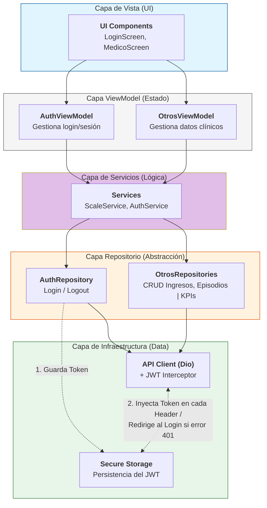

<a id="readme-top"></a>

# Klinico 🏥 - App de Gestión Clínica Hospitalaria

Klinico es una plataforma integral para la gestión de pacientes, admisiones y episodios clínicos, diseñada bajo estándares de alta disponibilidad y robustez técnica. Este proyecto se centra en la digitalización del flujo de trabajo médico, desde el ingreso del paciente hasta su alta, así como en la automatización de KPIs de interés para jefes de servicio.

## Estructura del proyecto

```text
lib/
├── core/                # Configuración global, constantes, temas, interceptores API
├── data/                # Capa de datos (Acceso a Red / Almacenamiento Local)
│   ├── models/          # Clases de datos (User, Patient, Admission...)
│   ├── services/        # Clases que hacen las llamadas HTTP (Dio o Http)
│   └── repositories/    # Lógica para decidir si los datos vienen de Red o Local
├── ui/                  # Capa de Interfaz de Usuario
│   ├── views/           # Tus Widgets de pantalla (Login, MedicoHome, etc.)
│   ├── viewmodels/      # La lógica de cada pantalla (State Management)
│   └── widgets/         # Componentes reutilizables (Botones, Inputs propios)
└── main.dart            # Punto de entrada de la aplicación
```

## Arquitectura MVVM



<p align="right">(<a href="#readme-top">back to top</a>)</p>

